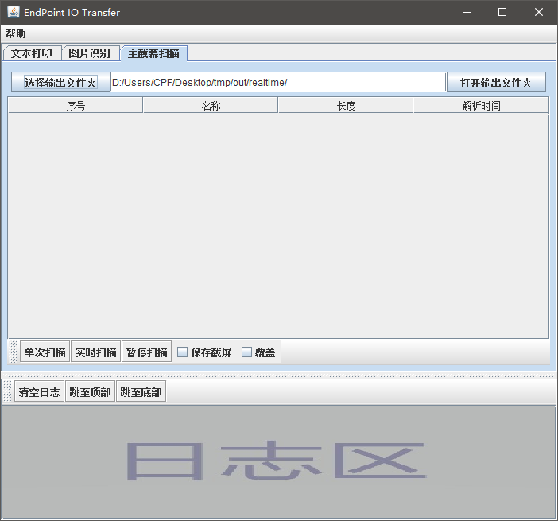

# endpoint-io-transfer

终端io传输工具, 方便远程终端设备的输入输出

- 输入: 先将文件转换为Base64编码,再通过文本打印功能将Base64编码输入至远程, 在远程再将Base64编码转换为文件
- 输出: 远程通过 remote-tool 将数据 转化为 bdmp 图片在屏幕上进行显示, 之后本地 endpoint-io-transfer 程序通过识别屏幕显示的图片, 将图片还原成文件.

> bdmp 图片详细请查看
> - <https://github.com/cosycode/bit-data-map>
> - <https://gitee.com/cosycode/bit-data-map>

## 功能介绍

1. 文本打印功能

   模拟按键功能, 向窗口粘贴文本后, 等待 2000 毫秒(看图中配置), 程序会模拟按键输入文本数据.
   > 这是一个简单的模拟按键的功能, 可输出中文, 可以解决本地无法通过粘贴功能往远程输出文本的情况.
   > 
   > 如下图所示, 左侧是本地程序, 右侧是远程桌面, 将本文粘贴到左侧窗口, 点击开始打印后, 将鼠标焦点切换至远程桌面的记事本中, 本地程序实现将左侧文本数据输出至远程桌面.
   > 

2. 主屏幕试试扫描,并解析bdmp图片为文件

   通过实时扫描主屏幕(如果有多屏幕的情况, 可以将远程桌面放到主屏幕), 并自动识别屏幕是否有bdmp图像, 若有正确的图像, 则将图像解析至文件数据, 并存至本地.

   

3. 远程生成图片并自动播放幻灯片

   将远程文件夹里面的文件转换成bdmp图片, 并循环播放幻灯片.
   > 生成方式请参考下面的 [remote-tool命令](#remote-tool.jar)

## 环境准备

1. 该程序是使用Java1.8编写的jar程序, 请在本机和远程均安装并配置好JRE1.8运行环境.
2. 本地 获取 endpoint-io-transfer 执行程序.
3. 将 remote-tool 传输至远程终端.
   > 如果可以直接往往远程拷贝文件的话, 则就按你的方式拷贝文件, 然后就可以跳过此步骤!
   > 如果没有上传渠道, 可以使用 endpoint-io-transfer 的 **文本打印功能** 上传文件
   > (remote-tool.jar文件大概只有40Kb, 4到5分钟应该就可以传完了).

### remote-tool.jar

remote-tool.jar 是一个可执行jar, 其功能如下

1. 将Base64编码文本文件转换为文件
   
   command: `java -cp remote-tool.jar cn.cpf.man.Base64Decode -f ${base64位编码文件路径}`

   ```conf
   f: 待转换的Base64编码文件路径
   d: 转换文件的保存位置, 默认将文件保存至当前文本文件夹
   ```

2. 将剪贴板中的文本渲染成 bit-data-map 图片. 并显示

    command: `java -cp remote-tool.jar cn.cpf.man.ShowFrameWithBdmpForClipboard -r 800 -px 2 -m 20`

   ```conf
   r : 生成的图片一行渲染多少个数据点
   px: 每个数据点的边长
   m : 生成的图片边缘宽度
   p2: 生成的每个数据点携带几个bit数据(默认为8)
   ```

3. 将文件转换为bit-data-map

   ```conf
   f 待转换为bit-data-map的源文件路径(不能为空)
   d : 生成的图片保存路径
   r : 生成的图片一行渲染多少个数据点
   px: 每个数据点的边长
   m : 生成的图片边缘宽度
   p2: 生成的每个数据点携带几个bit数据(默认为8)
   inv: 如果路径是文件夹, 文件夹里面有多张图片, 渲染每张图片的时间间隔
   maxLen: 如果路径是文件夹, 渲染的文件最大大小, 默认最大为400K, 如果文件大小超过400K, 则跳过渲染
   ```

4. 如果参数路径指向文件, 则将文件转换为 bit-data-map 并显示, 如果参数是文件夹, 则遍历文件夹里面的文件, 并按照配置的时间间隔循环显示.

    command: `java -cp remote-tool.jar cn.cpf.man.ShowFrameWithPixelPngForFile -p ${文件或文件夹路径} -r 800 -px 2 -m 20 -inv 2000 -maxLen 300000`

   ```conf
   p 文件或文件夹路径
   r : 生成的图片一行渲染多少个数据点
   px: 每个数据点的边长
   m : 生成的图片边缘宽度
   p2: 生成的每个数据点携带几个bit数据(默认为8)
   inv: 如果路径是文件夹, 文件夹里面有多张图片, 渲染每张图片的时间间隔
   maxLen: 如果路径是文件夹, 渲染的文件最大大小, 默认最大为400K, 如果文件大小超过400K, 则跳过渲染
   ```
