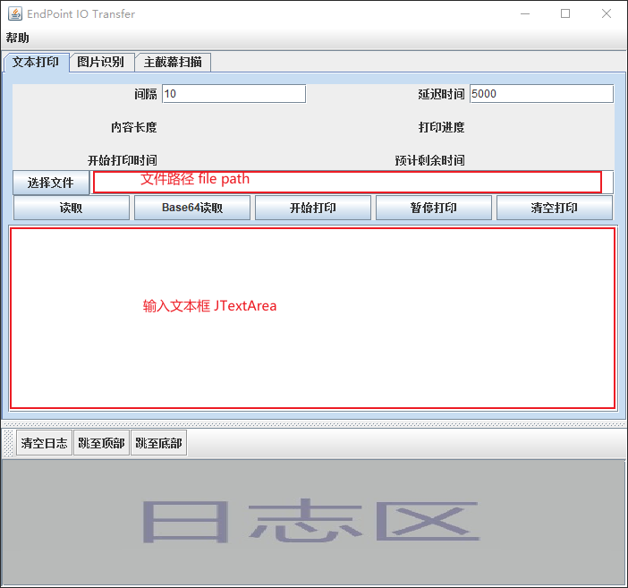
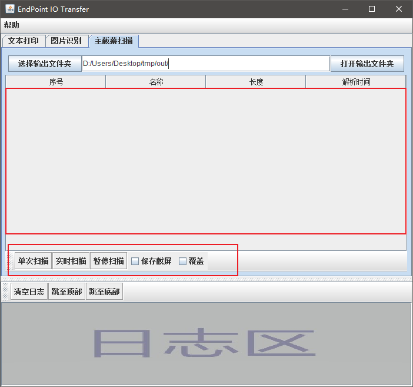
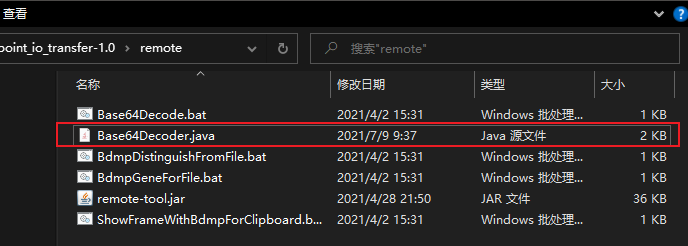
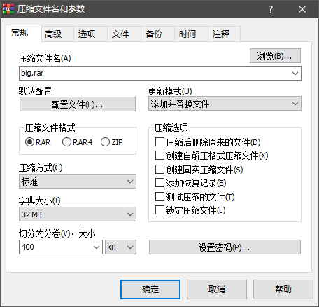
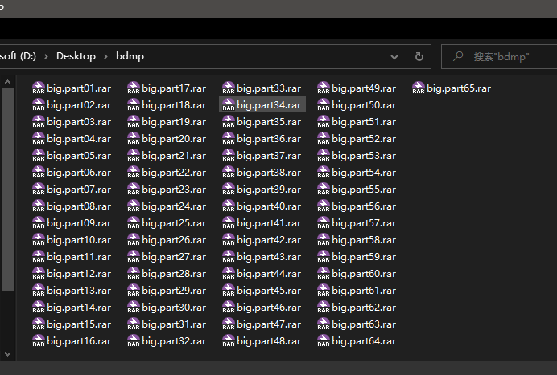
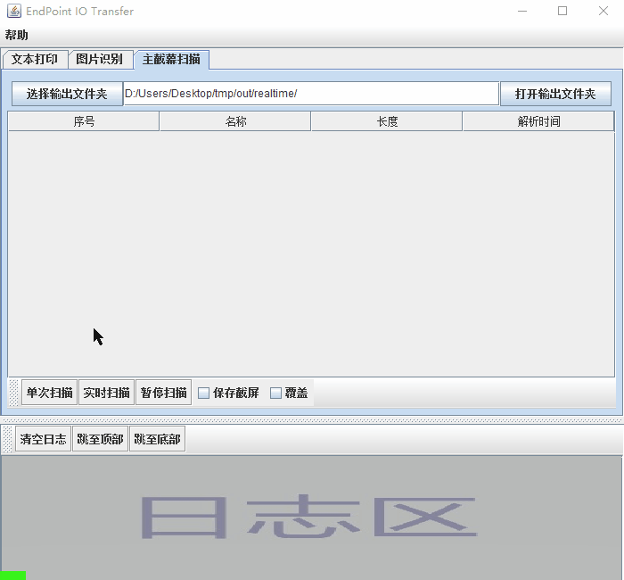

# endpoint-io-transfer

终端io传输工具, 方便远程终端设备的输入输出

- 输入: 先将文件转换为Base64编码,再通过文本打印功能将Base64编码输入至远程, 在远程再将Base64编码转换为文件
- 输出: 远程通过 remote-tool 将数据 转化为 bdmp 图片在屏幕上进行显示, 之后本地 endpoint-io-transfer 程序通过识别屏幕显示的图片, 将图片还原成文件.

> bdmp 图片详细请查看
> - <https://github.com/cosycode/bit-data-map>
> - <https://gitee.com/cosycode/bit-data-map>

## 1. 功能介绍

1. 文本打印功能(用于将数据打印到远程终端)
   > - 请参考 [4.1、将非文本文件以文本打印功能传输至远程终端](#4.1、将非文本文件以文本打印功能传输至远程终端)
2. 主屏幕试试扫描,并解析bdmp图片为文件(用于从终端获取数据文件)
   > 请参考下面的章节
   > - [4.2、从远程终端获取数据文件](#4.2、从远程终端获取数据文件)
   > - [5、`remote-tool`相关main()方法](#5、`remote-tool`相关main()方法)

## 2. 环境准备

1. 该程序是使用Java1.8编写的jar程序, 请在本机和远程均安装并配置好JRE1.8运行环境.
2. 本地 获取 endpoint-io-transfer 执行程序.
   > 在当前项目 `release` 下载最新的发布包
3. 将 remote-tool 传输至远程终端.
   > 如果可以直接往往远程拷贝文件的话, 则就按你的方式拷贝文件, 然后就可以跳过此步骤!
   > 如果没有上传渠道, 可以使用 endpoint-io-transfer 的 **文本打印功能** 上传文件
   > (remote-tool.jar文件大概只有40Kb, 4到5分钟应该就可以传完了).
4. 根据需要结合`bat文件`和`remote-tool.jar`生成`bit-data-map`

---
---

## 3、界面介绍

### 3.1、文本打印

模拟按键功能, 向窗口粘贴文本后, 等待 2000 毫秒(看图中配置), 程序会模拟按键输入文本数据.

> 这是一个简单的模拟按键的功能, 可输出中文, 可以解决本地无法通过粘贴功能往远程输出文本的情况.



#### 文本打印.相关组件介绍

1. 交互输入框介绍

   - 间隔: 循环打印每个字符间的延迟时间(毫秒)
   - 延迟时间: 点击开始打印按钮到开始打印之间的延迟时间(毫秒), 它的目的是为了给一个
   - 文件路径输入框: 交互输入和显示读取的文件路径(可拖拽文件到输入框)
   - 输入文本框: 交互输入和显示需要打印的内容

2. 按钮介绍(点击按钮事件)

   - 选择文件: 弹出选择文件对话框, 选择文件后会在右侧`文件路径输入框`中显示出文件路径.
   - 读取(用于文本文件的读取): 会读取`文件路径输入框`中的内容, 并查找指定的文件, 若成功找到文件, 会读取文件内容, 并将内容在`输入文本框`中显示出来
   - Base64读取(用于非文本文件的读取): 会读取`文件路径输入框`中的内容, 并查找指定的文件, 若成功找到文件, 会读取文件内容, 将内容转换成`Base64`编码, 并将转换后的在`输入文本框`中显示出来
   - **开始打印(主要功能)**: 首先延迟一定时间(延迟时间参考输入框`延迟事件`设置的值), 之后读取`输入文本框`中的内容, , 并模拟键盘按键模拟键盘敲击`输入文本框`中的内容, 一个字一个字的敲击(敲击速率参考`间隔`输入框设置的值), 直到所有文本模拟打印完成.
   - 暂停打印: 暂停打印
   - 清空打印: 清空`输入文本框`中的内容

#### 文本打印.简单操作

1. 非文本文件读取(Base64读取)演示

   > 

2. 文本打印功能演示

   >如下图所示, 左侧是本地程序, 右侧是远程桌面, 将本文粘贴到左侧窗口, 点击开始打印后, 将鼠标焦点切换至远程桌面的记事本中, 本地程序实现将左侧文本数据输出至远程桌面.
   > 

#### 文本打印.注意事项

- 打印时需要将输入法调制英文
- 打印可以打印中文, 但是输入法依然需要设置为英文输入法

---

### 3.2、主屏幕扫描

可以自动识别主屏幕的`bit-data-map`, 并将其转换成文件或数据, 若`bit-data-map`内容是一个文件, 会列在下面的表格中



> 主屏幕: 若只有一个屏幕, 则这个屏幕就是主屏幕, 若有外接屏幕, 则主屏幕指的是OS系统设定的主屏幕

#### 组件介绍

1. 按钮点击事件

1. 选择输出文件夹: 弹出文件夹选择框, 选择输出文件夹
2. 打开输出文件夹: 系统文件浏览器打开`文件路径输入框`中的文件夹
3. 单次扫描: 对主屏幕进行截屏, 并分析是否是`bit-data-map`, 若是, 则对其进行解析成文件或数据, 保存在本地(`文件路径输入框`所指向的文件夹)
4. 实时扫描: 每秒执行一次`单次扫描`的操作.
5. 暂停扫描: 暂停扫描操作
6. 保存截屏: 若选中, 则截取主屏幕后, 会将截取的图片保存在本地(`文件路径输入框`所指向的文件夹)
7. 覆盖: 选中后, 若截屏解析`bit-data-map`出来的文件名在本地文件夹中已存在, 则进行覆盖, 若该复选框未选中, 则直接废弃最新的`bit-data-map`数据.

---

## 4、使用方式

### 4.1、将非文本文件以文本打印功能传输至远程终端

1. 将文件转换成Base64编码, 再显示到 `endpoint_io_transfer` 的文本打印功能的输入框中.

   > 通过`endpoint_io_transfer`的Base64位读取文件成Base64编码演示示例.
   

2. 通过文本打印功能将编码输入到远程(可能有点慢)

   1. 在远程建立txt文本, 并使用记事本打开(最好是系统自带记事本)
   2. 将本地和远程的输入法均切换至英文
   3. 点击本地电脑`endpoint_io_transfer`的打印按钮, 并在5秒内将光标移动至远程桌面的空白记事本中
   4. 等待`endpoint_io_transfer`将输入框中的内容一点点的输入到远程桌面, 待打印完毕后, 远程记事本保存.

3. 在远程桌面编写 `Base64` 编码解析脚本

   > 如果远程有Base64解码工具, 则可以直接使用, 若没有请参考下面的步骤建立起简单的工具解析`Base64`编码成文件.
   > `remote-tool.jar` 是有封装`Base64`编码解析工具的, 但前提是你需要先把`remote-tool.jar`弄到远程桌面.

   下载的`endpoint_io_transfer`压缩包的 remote 文件夹里面应该有一个 `Base64Decode.java` 文件, 先将这个文件通过文本打印功能输入到远程桌面

   `Base64Decode.java` 文件示例如下

   > `Base64Decode.java`的作用是将Base64编码解析成一个文件.

   ```java
   import java.io.*;
   import java.nio.file.FileSystemException;
   import java.util.Base64;

   public class Base64Decode {

      /**
      * 将Base64编码文件转换为文件
      *
      * @param args -f 待转换的Base64编码文件路径
      *             -d 转换文件的保存位置
      * @throws IOException 文件不存在或读取失败
      */
      @SuppressWarnings("java:S106")
      public static void main(String[] args) throws IOException {
         final String filePath = args[0];
         File file = new File(filePath);
         if (!file.exists()) {
               throw new FileNotFoundException("文件不存在 ==> " + filePath);
         }
         if (!file.isFile()) {
               throw new FileSystemException("不是文件 ==> " + filePath);
         }
         String savePath = "";
         if (args[1] == null || args[1].trim().isEmpty()) {
            savePath = file.getParentFile().getPath() + File.separator + "base64DecodeFile";
         } else {
            savePath = args[1];
         }
         try (FileReader reader = new FileReader(file)) {
               char[] chars = new char[(int) file.length()];
               final int read = reader.read(chars);
               System.out.println("读取字符数量 ==> " + read);
               String base64 = new String(chars);
               base64 = base64.trim();
               byte[] bytes = Base64.getDecoder().decode(base64);
               writeFile(savePath, bytes);
         } catch (IOException e) {
               e.printStackTrace();
         }
      }

      public static void writeFile(String savePath, byte[] content) {
         final File file = new File(savePath);
         try (final FileOutputStream writer = new FileOutputStream(file)) {
               writer.write(content);
         } catch (IOException e) {
               e.printStackTrace();
         }
      }
   }
   ```

   操作示例  
   > gif图片里面java文件名随便输的, 输错了，改过来就行了, 改成和类名相同的

4. 利用 Base64Decode.java 还原Base64位编码文件为`remote-tool.jar`

   > 此时远程终端应该有这两个文件, 当前示例中 文件存放在 `D:\Desktop\` 文件夹里.
   > 
   > 
   > - base64.txt: 步骤2输入的Base64位编码文件
   > - Base64Decode.java: 步骤3 输入的java文件

   1. 在文件所在文件夹打开 cmd 窗口 
   2. 将 Base64Decode.java 成 class 源文件

      ```bat
      javac Base64Decode.java
      ```

   3. 利用 Base64Decode.class 解码 `base64.txt` 文件为 `remote-tool.jar`
      > 注意路径需要是全路径
      ```bat
      java Base64Decode D:\Desktop\base64.txt D:\Desktop\remote-tool.jar
      ```

   

   

> 操作成功后, 就可以将 `remote-tool.jar` 以外的文件全删掉了, 因为`remote-tool.jar`里面内置了`Base64`解码的相关功能

### 4.2、从远程终端获取数据文件

数据传出方式

   1. 远程小文件传出
   2. 远程大文件传出
   3. 远程粘贴板内容传出到本地系统粘贴板(只支持文本格式)

#### 远程大文件传出示例


看上面的 `big.data` 文件(25M大小), 如何从远程取出来呢?

1. 先将 `big.demo` 文件压缩成 `分卷400K` 的小文件, 并放到一个空文件夹里面

   > 
   > 压缩成了 65 个小文件, 每个最大 400K.
   将压缩的文件放到新建的`bdmp` 文件夹, 如下图所示
   > 
   
2. 本地电脑运行 `endpoint-io-transfer.jar`, 并到主线程扫描页面, 进行实时扫描

   

3. 播放文件`bit-data-map`图: 将 `bdmp` 文件夹拖拽到 `ShowFrameWithBdmpForFile.bat` 上运行.

   > 或启动命令行运行`ShowFrameWithBdmpForFile.bat`也行, 将文件夹路径作为参数, 一样的效果!!!

   `ShowFrameWithBdmpForFile.bat`代码

   ```bat
   @echo off

   set appJar="remote-tool.jar"
   echo path: %1

   java -cp %appJar% cn.cpf.man.ShowFrameWithBdmpForFile -p %1 -r 920 -px 2 -m 15 -p2 8 -inv 1000 -maxlen 409600
   pause
   ```

   > 参数详情请看API: [cn.cpf.man.ShowFrameWithBdmpForFile](/api/api-remote-tool.md)

   `ShowFrameWithBdmpForFile.bat` 会对文件夹中的文件进行循环处理, 将其中的每个小于等于400K的文件转换成`bit-data-map`图片并显示出来.

   

3. 接下来就会在`endpoint-io-transfer.jar`面板看到本地获取的文件

   

## 5、`remote-tool`相关main()方法

remote-tool.jar 是一个可执行jar, 其功能如下

1. 将Base64编码文本文件转换为文件
   
   command: `java -cp remote-tool.jar cn.cpf.man.Base64Decode -f ${base64位编码文件路径}`

   ```conf
   f: 待转换的Base64编码文件路径
   d: 转换文件的保存位置, 默认将文件保存至当前文本文件夹
   ```

2. 将剪贴板中的文本渲染成 bit-data-map 图片. 并显示

    command: `java -cp remote-tool.jar cn.cpf.man.ShowFrameWithBdmpForClipboard -r 800 -px 2 -m 20`

   ```conf
   r : 生成的图片一行渲染多少个数据点
   px: 每个数据点的边长
   m : 生成的图片边缘宽度
   p2: 生成的每个数据点携带几个bit数据(默认为8)
   ```

3. 将文件转换为bit-data-map

   ```conf
   f 待转换为bit-data-map的源文件路径(不能为空)
   d : 生成的图片保存路径
   r : 生成的图片一行渲染多少个数据点
   px: 每个数据点的边长
   m : 生成的图片边缘宽度
   p2: 生成的每个数据点携带几个bit数据(默认为8)
   inv: 如果路径是文件夹, 文件夹里面有多张图片, 渲染每张图片的时间间隔
   maxLen: 如果路径是文件夹, 渲染的文件最大大小, 默认最大为400K, 如果文件大小超过400K, 则跳过渲染
   ```

4. 如果参数路径指向文件, 则将文件转换为 bit-data-map 并显示, 如果参数是文件夹, 则遍历文件夹里面的文件, 并按照配置的时间间隔循环显示.

    command: `java -cp remote-tool.jar cn.cpf.man.ShowFrameWithBdmpForFile -p ${文件或文件夹路径} -r 800 -px 2 -m 20 -inv 2000 -maxLen 300000`

   ```conf
   p 文件或文件夹路径
   r : 生成的图片一行渲染多少个数据点
   px: 每个数据点的边长
   m : 生成的图片边缘宽度
   p2: 生成的每个数据点携带几个bit数据(默认为8)
   inv: 如果路径是文件夹, 文件夹里面有多张图片, 渲染每张图片的时间间隔
   maxLen: 如果路径是文件夹, 渲染的文件最大大小, 默认最大为400K, 如果文件大小超过400K, 则跳过渲染
   ```

---
---

<h3><span style="color:red">本软件不得用于商业用途，仅做学习交流!!!</span></h3>
<h3><span style="color:red">请谨慎使用, 请勿使用本软件违法获取信息和资源, 否则后果自负!!!</span></h3>
